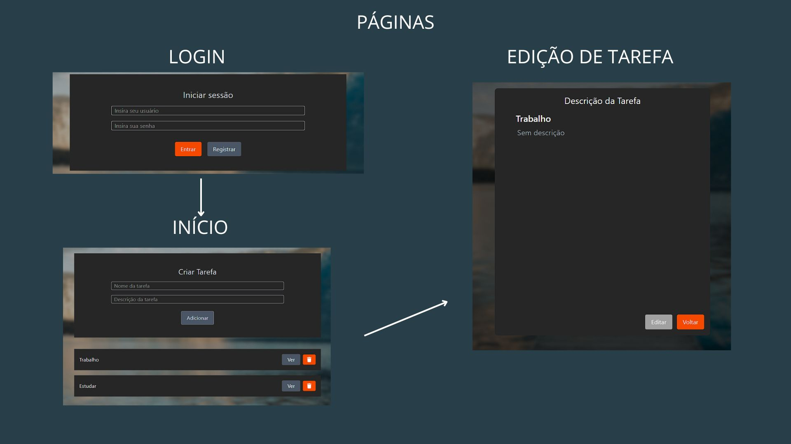

# 📋 TO DO LIST 
游 Crie e organize suas tarefas diárias de forma simples e eficiente. Com um sistema de cadastro, o aplicativo garante que cada usuário tenha acesso exclusivo 맙 suas próprias listas, mantendo a privacidade e a organização.

# 👾 Tecnologias
- ** Frontend: ** HTML, CSS, Javascript, React e Tailwind
- ** Backend: ** Node JS, Express, JWT
- ** Banco de dados: ** SQLite 3

** O projeto possui duas branchs, a `cadastro-de-usuarios` conta com o sistema de login, enquanto a branch `main` conta com a lista de tarefas, apenas.

# 👣 Como rodar o projeto
1. Clone o repositório
1. Rode o comando `npm install`
2. Inicie a aplicação com `npm start`

** PRONTO! O app estará funcionando.

# 🚀 PROJETO FINALIZADO 

